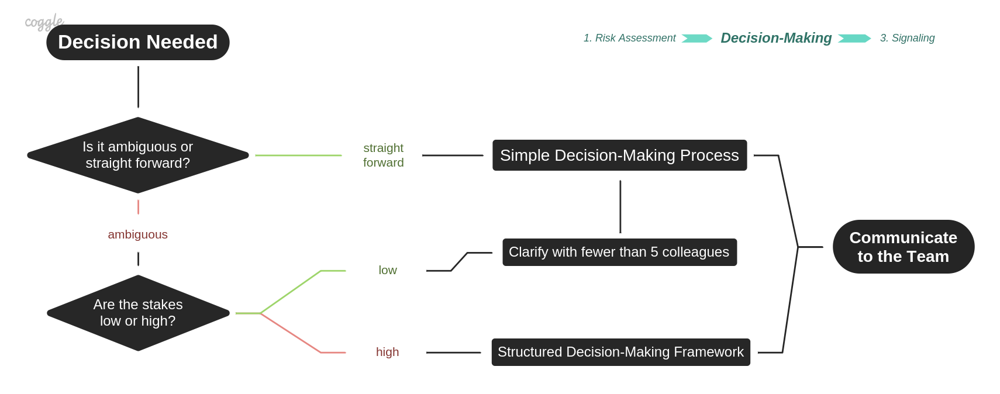
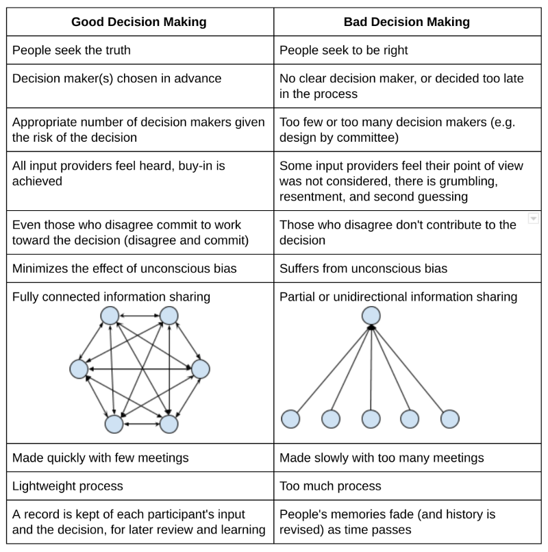

# Decision-Making

## 1. Risk Assessment

How do we define risk, ambiguity and loss; how different aversions work; and most importantly a few heuristics on how to put those understandings in practice.



## Decision-Making



Prioritizes execution over deliberation. Empowering a team to execute comes with the risk of making more mistakes.



Is only needed when there is lack of clarity about a decision that is _higher risk_. Higher risk can mean that the decision has long term implications or that it can be costly to unwind if the wrong decision is made.[\*](./)


If the decision is both ambiguous and high-stakes, we use the **framework**. If the decision is only ambiguous, the decision-maker can **collaborate** with a few people and make the call. And if the decision is neither ambiguous or high-stakes, the decision-maker should simply **move forward**. In all cases, **communication** to the team completes the decision.


### What does good decision making look like?

## 3. Signaling

> A decision is not complete until all impacted by that decision are notified. if you'd never abandon a puppy, why abandon decisions outputs? Think about the puppies.



